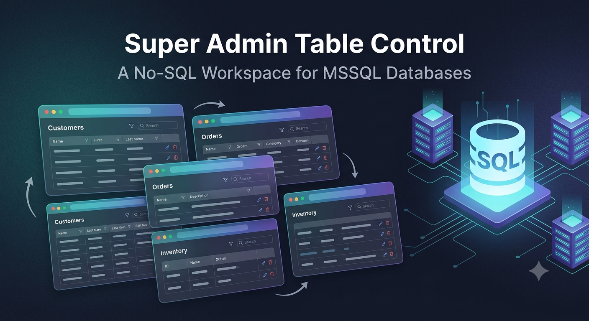
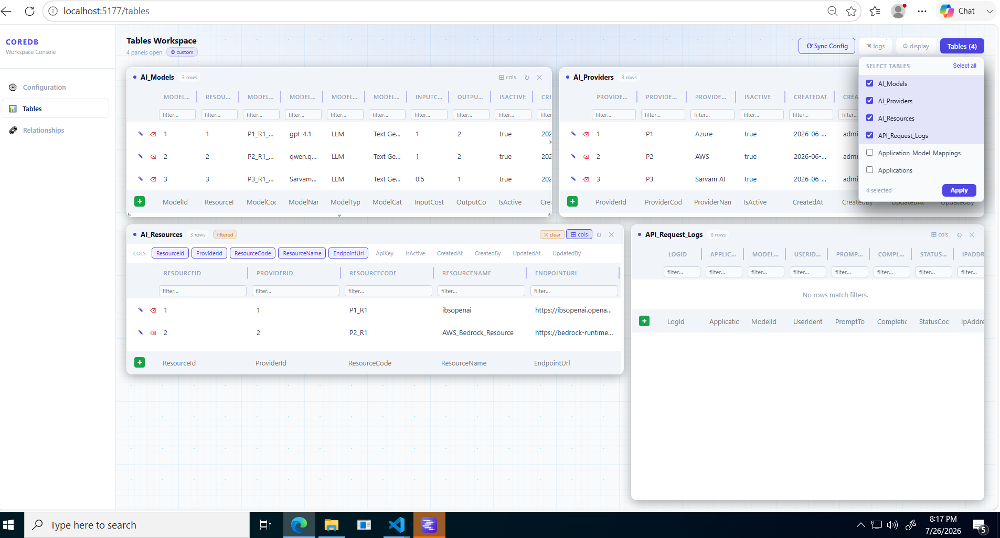
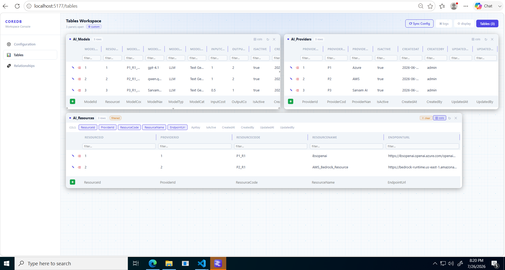
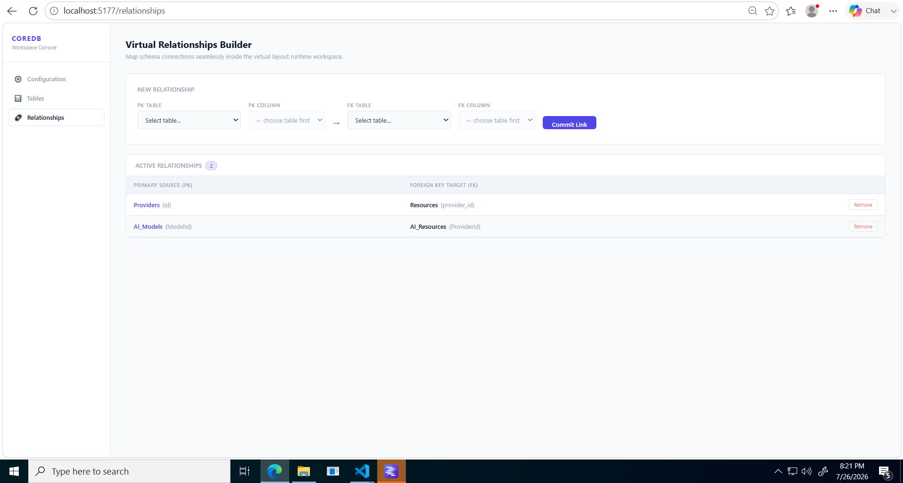
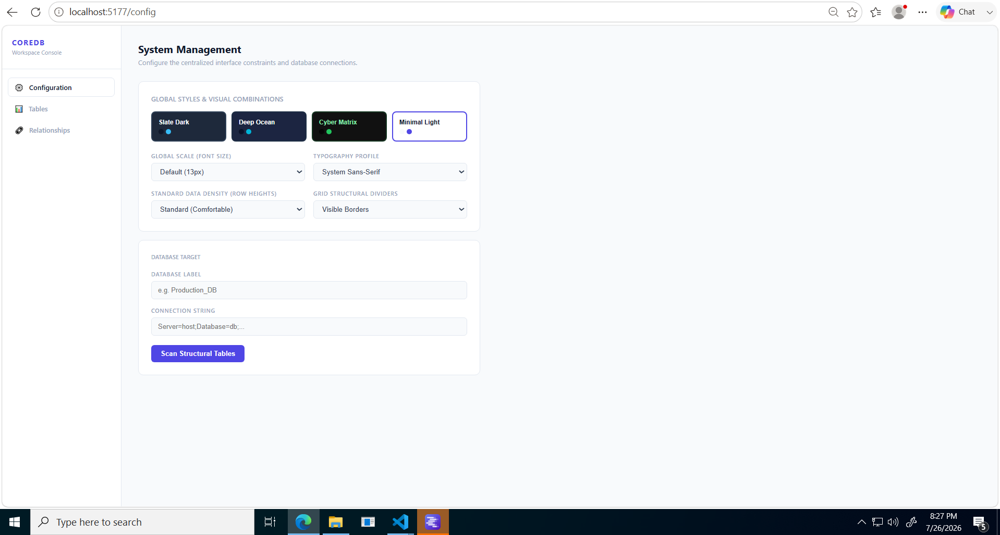

<div align="center">



# Super Admin Table Control

### A no-SQL workspace for managing Microsoft SQL Server tables

Browse, filter, search, and edit your database records through an interactive browser UI — no SQL knowledge required.


</div>

---

## Table of Contents

- [What is Super Admin Table Control?](#what-is-super-admin-table-control)
- [Features](#features)
- [Screenshots](#screenshots)
- [Tech Stack](#tech-stack)
- [Project Structure](#project-structure)
- [Prerequisites](#prerequisites)
- [Installation](#installation)
- [Configuration](#configuration)
- [Usage](#usage)
- [Database Support](#database-support)
- [Roadmap](#roadmap)
- [Contributing](#contributing)
- [License](#license)

---

## What is Super Admin Table Control?

Super Admin Table Control is a web-based database management tool built for teams and individuals who work with SQL Server databases daily but want to avoid writing ad hoc queries for routine data tasks.

Instead of switching between SQL clients, query editors, and spreadsheets, Super Admin Table Control gives you a single flexible workspace where every database table becomes a draggable, resizable panel. Open as many tables as you need, arrange them side by side, apply filters, search records, and make data changes — all from the browser, without touching a line of SQL.

The project is split into a Node.js/Express backend that handles database connectivity and query execution, and a React/Vite frontend that renders the interactive workspace.

---

## Features

**Workspace**
- Open multiple database tables simultaneously as independent panels
- Drag panels freely across the workspace to arrange them as needed
- Resize individual table panels for a better view
- Show or hide any panel at any time without closing it
- Refresh table data instantly with a single click

**Data Management**
- Full CRUD operations — create new rows, read and browse existing data, update field values, and delete records
- Per-column filtering to narrow down displayed rows
- Global record search across visible data
- Column selector to show or hide specific fields per table

**Accessibility**
- Connects to Microsoft SQL Server via a configurable backend
- No SQL knowledge required for everyday operations
- Designed for both technical and non-technical users

---

## Screenshots

### Interactive Workspace












---

## Tech Stack

**Frontend**

| Technology | Role |
|---|---|
| React | Component-based UI |
| Vite | Development server and build tool |
| JavaScript | Application logic |
| CSS | Styling |

**Backend**

| Technology | Role |
|---|---|
| Node.js | Runtime environment |
| Express.js | HTTP server and API routing |

**Database**

| Technology | Role |
|---|---|
| Microsoft SQL Server | Supported database engine |

---

## Project Structure

```
Super-Admin-Table-Control/
├── backend/
│   ├── config/
│   ├── controllers/
│   │   └── configController.js       # Handles config read/write requests
│   ├── data/
│   │   └── config.json               # Persisted database connection settings
│   ├── routes/
│   │   └── api.js                    # API route definitions
│   ├── services/
│   │   ├── ConfigStore.js            # In-memory configuration management
│   │   ├── dbService.js              # SQL Server connection and query logic
│   │   └── storageService.js         # File-based config persistence
│   ├── .env                          # Environment variables (not committed)
│   ├── package.json
│   └── server.js                     # Express app entry point
├── frontend/
│   ├── public/
│   │   ├── favicon.svg
│   │   └── icons.svg
│   ├── src/
│   │   ├── assets/
│   │   ├── pages/
│   │   │   ├── ConfigPage.jsx        # Database connection configuration UI
│   │   │   ├── RelationshipPage.jsx  # Table relationship viewer
│   │   │   ├── TablesDashboard.jsx   # Main workspace with draggable panels
│   │   │   └── TestServerPage.jsx    # Server connectivity test
│   │   ├── api.js                    # Frontend API client
│   │   ├── App.jsx
│   │   └── main.jsx
│   ├── index.html
│   ├── package.json
│   └── vite.config.js
├── images/                           # Screenshots
└── project_structure.txt
```

---

## Prerequisites

- Node.js v18 or later
- npm v9 or later
- Access to a Microsoft SQL Server instance

---

## Installation

**1. Clone the repository**

```bash
git clone https://github.com/abhirajsingh1234/Super-Admin-Table-Control.git
cd Super-Admin-Table-Control
```

**2. Install backend dependencies**

```bash
cd backend
npm install
```

**3. Install frontend dependencies**

```bash
cd ../frontend
npm install
```

---

## Configuration

Create a `.env` file inside the `backend/` directory with your SQL Server connection details:

```env
DB_SERVER=your_server_address
DB_PORT=1433
DB_USER=your_username
DB_PASSWORD=your_password
DB_NAME=your_database_name
```

You can also configure the connection through the in-app Config page after starting the servers — settings are saved to `backend/data/config.json` for persistence.

---

## Usage

**Start the backend**

```bash
cd backend
npm start
```

The API will be available at `http://localhost:3000`.

**Start the frontend**

```bash
cd frontend
npm run dev
```

Open the application in your browser:

```
http://localhost:5173
```

**Workflow**

1. Go to the Config page and enter your SQL Server connection details, then save.
2. Use the Test Server page to verify the connection is working.
3. Navigate to the Tables Dashboard and load the list of available tables.
4. Select the tables you want to work with — each opens as a panel in the workspace.
5. Drag and resize panels to arrange them as needed.
6. Use the column selector to show or hide specific fields.
7. Apply column filters or use the search bar to locate specific records.
8. Create, edit, or delete rows directly from the table panels.
9. Click the refresh button on any panel to reload its data.

---

## Database Support

| Database | Status |
|---|---|
| Microsoft SQL Server | Supported |
| PostgreSQL | Planned |
| MySQL | Planned |
| Oracle Database | Planned |
| SQLite | Planned |

---

## Roadmap

- [x] Microsoft SQL Server support
- [x] Full CRUD operations
- [x] Per-column filtering
- [x] Custom column visibility selection
- [x] Multi-table drag-and-drop workspace
- [x] Table relationship page
- [ ] PostgreSQL support
- [ ] MySQL support
- [ ] Export data to CSV or Excel
- [ ] Role-based access control
- [ ] Dark mode UI

---

## Contributing

Contributions, feature requests, and bug reports are welcome.

If you have an idea to improve Super Admin Table Control, open an issue first to discuss it. When submitting a pull request, keep your changes focused and include a clear description of what was changed and why.

1. Fork the repository
2. Create a feature branch (`git checkout -b feature/your-feature-name`)
3. Commit your changes (`git commit -m "Add your feature"`)
4. Push to your fork (`git push origin feature/your-feature-name`)
5. Open a pull request against the `master` branch

---

## License

This project is licensed under the [MIT License](LICENSE).